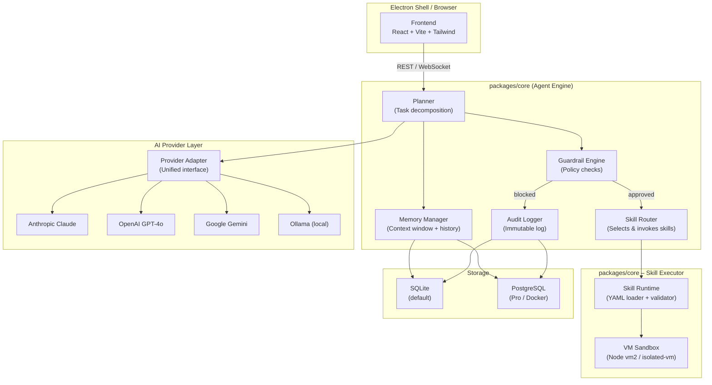
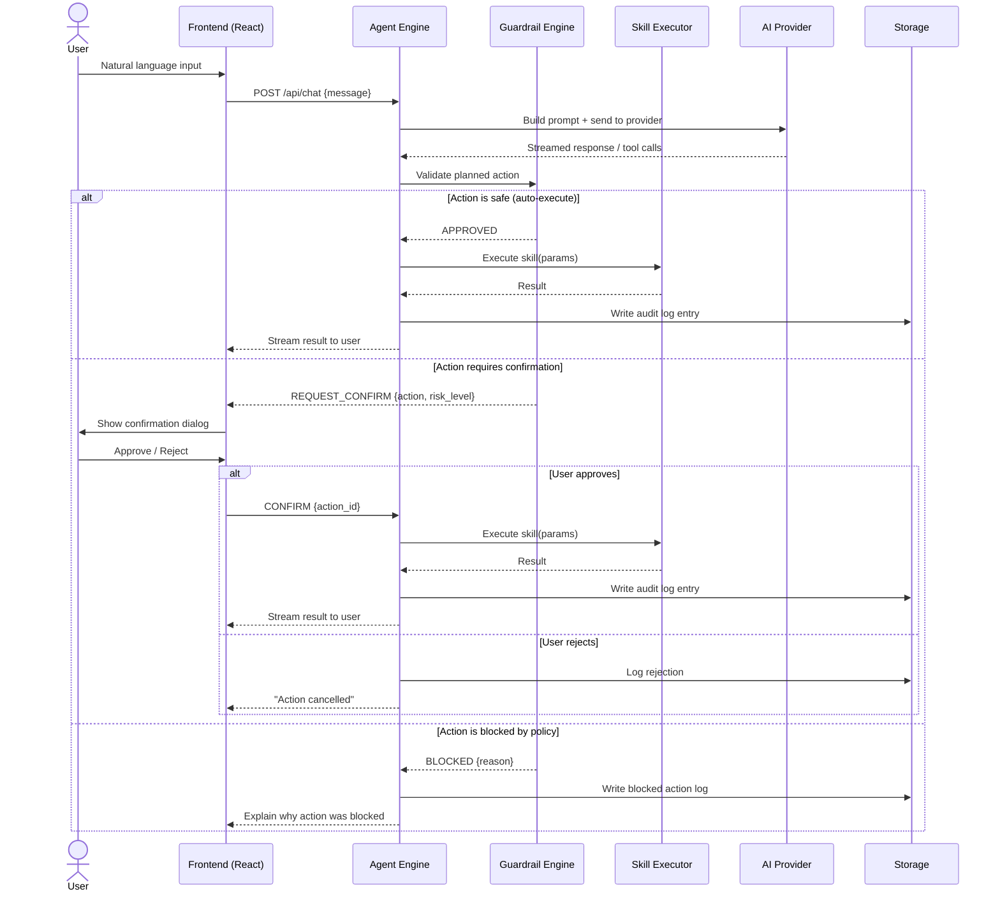
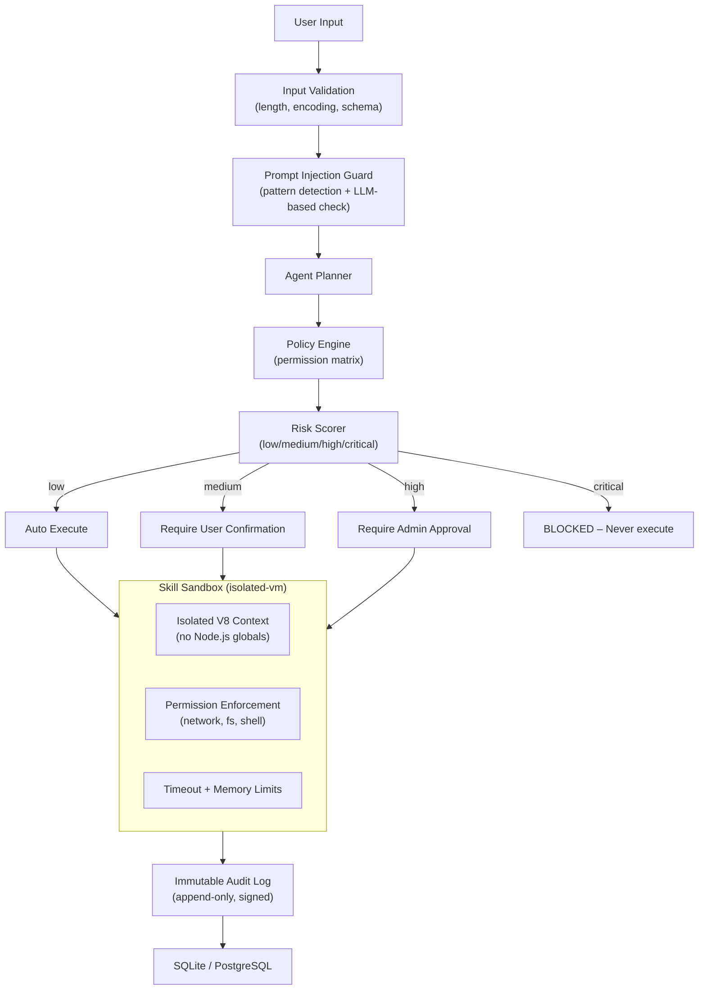

# Vela – System Architecture

> This document describes the complete architecture of Vela: component boundaries, data flows, and security model.

---

## System Overview

Vela is structured as a layered architecture with clear separation between presentation, orchestration, execution, and storage. The system runs entirely on the user's machine (Electron mode) or on a self-hosted server (Docker Pro mode).

```
┌─────────────────────────────────────────────┐
│                  User Interface              │
│         React + TypeScript + Tailwind        │
├─────────────────────────────────────────────┤
│               Agent Engine (Core)            │
│    Planner · Memory · Guardrails · Router    │
├──────────────────┬──────────────────────────┤
│   Skill Executor │   AI Provider Layer       │
│   (Sandboxed VM) │   (Claude/GPT/Gemini/     │
│                  │    Ollama adapter)        │
├──────────────────┴──────────────────────────┤
│            Storage (SQLite / PostgreSQL)     │
│     Conversations · Skills · Audit Log       │
└─────────────────────────────────────────────┘
```

---

## Component Diagram



---

## Data Flow Diagram: User → Vela → Action



---

## Security Layer Diagram



---

## Component Descriptions

### Frontend (`packages/ui`)
The React-based dashboard that adapts its complexity to the user's mode:
- **Simple Mode**: Chat interface, recent actions, one-click skill triggers. Designed for non-technical users.
- **Expert Mode**: Full agent workspace with skill editor, live audit log viewer, model selector, and debug console.

Communication with the backend is via REST for CRUD operations and WebSocket for streaming agent output.

### Agent Engine (`packages/core`)

**Planner**
Decomposes natural language input into a sequence of steps. Uses chain-of-thought prompting internally, but exposes only the final plan to the user in Simple Mode. In Expert Mode, the full reasoning trace is visible.

**Memory Manager**
Maintains multiple memory types:
- *Working memory*: current conversation context window (trimmed to model limits)
- *Episodic memory*: conversation history stored in DB, retrieved via recency + semantic similarity
- *Skill memory*: cached results of previous skill executions to avoid redundant calls

**Guardrail Engine**
Enforces the permission policy before any action is executed. The policy matrix defines:
- Which skills require confirmation
- Which are auto-approved
- Which are always blocked (e.g., `shell.exec` in Simple Mode)

The engine runs *before* the skill executor is invoked — not as a post-hoc filter.

**Skill Router**
Matches the planner's selected action to the correct installed skill, resolves dependencies, and passes typed parameters to the Skill Runtime.

**Audit Logger**
Writes every action — attempted, confirmed, rejected, or blocked — to an append-only log. Entries are timestamped and include: input hash, planned action, guardrail decision, execution result, and model used. In Docker Pro mode, entries can be exported to SIEM systems.

### Skill Executor (`packages/core`)

**Skill Runtime**
Loads and validates YAML manifests. Checks the declared `permissions` field against the current policy before passing the skill to the VM.

**VM Sandbox**
Uses `isolated-vm` (V8 isolate, not Node.js `vm` module) to execute skill TypeScript/JavaScript. The sandbox:
- Has no access to `require`, `process`, `fs`, or `net` by default
- Receives only explicitly injected APIs matching the declared permissions
- Enforces memory and CPU time limits
- Any exception or timeout triggers a clean abort with no side effects

### AI Provider Layer

A single `AIProvider` interface with implementations for:
- `AnthropicAdapter` — streaming via Anthropic SDK
- `OpenAIAdapter` — streaming via OpenAI SDK
- `GeminiAdapter` — streaming via Google Generative AI SDK
- `OllamaAdapter` — local REST API (no external calls)

The active provider is configurable per-session in Expert Mode. Simple Mode uses the configured default.

### Storage

Schema-first design using [Drizzle ORM](https://orm.drizzle.team/), which generates type-safe queries and handles migrations for both SQLite and PostgreSQL with zero schema changes.

Key tables: `conversations`, `messages`, `skill_executions`, `audit_log`, `users`, `settings`.

---

## Security Architecture

### Sandbox Isolation
Skill code is never executed in the main Node.js process. `isolated-vm` creates a separate V8 heap with strict memory limits (default: 64MB) and execution timeouts (default: 10s). The host Node.js APIs are not accessible from within the isolate. Vela provides a curated set of safe APIs (e.g., `fetch` for permitted domains) injected explicitly.

### Guardrails
The guardrail engine is a core module, not a plugin. It cannot be disabled by a skill or an external prompt. Policy is stored in a protected configuration file (not in the database, to prevent prompt-injection-based policy manipulation). In Docker Pro mode, policy files are read-only bind-mounted.

### Prompt Injection Defense
- Pattern matching on known injection templates
- LLM-based secondary check for novel injection attempts (using a separate, smaller model call)
- Structural separation: user content and system instructions are never concatenated into a single string

### Audit Log Integrity
In Simple/Electron mode: audit log entries are written to a separate SQLite file with a row-level HMAC using a device key. Tampering with any row invalidates the chain.
In Docker Pro mode: logs are streamed to an append-only Postgres table with row-level checksums and optional export to external SIEM.

---

*Last updated: 2026-03-02*
