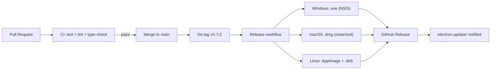

# Vela – GitHub Repository Structure

> This document describes the monorepo layout, explains what belongs in each package, and justifies the architectural decisions behind the structure.

---

## Why a Monorepo?

Vela's codebase spans multiple packages that share types, utilities, and business logic. A monorepo managed with **pnpm workspaces + Turborepo** provides:

- **Shared TypeScript types** across `core`, `ui`, `desktop`, and `cli` without publishing packages
- **Atomic commits** — a single PR can update the agent engine and the UI that depends on it simultaneously
- **Unified CI** — Turborepo's task graph runs only the affected packages' tests and builds
- **Consistent tooling** — one ESLint config, one TypeScript config base, one Prettier setup
- **Clear open/proprietary split** — `packages/pro` is a private git submodule within the monorepo

The alternative (separate repos per package) would require constant cross-repo version bumping and makes it nearly impossible for a 2-person team to move quickly.

---

## Full Directory Structure

```
vela/
├── packages/
│   ├── core/
│   ├── ui/
│   ├── desktop/
│   ├── cli/
│   └── pro/                    ← private git submodule
├── skills/
│   ├── web-search/
│   ├── file-manager/
│   ├── calendar/
│   └── ...
├── docs/
│   ├── tech-stack.md
│   ├── architecture.md
│   ├── swot.md
│   └── github-structure.md
├── .github/
│   ├── workflows/
│   │   ├── ci.yml
│   │   ├── release.yml
│   │   └── security-scan.yml
│   ├── ISSUE_TEMPLATE/
│   │   ├── bug_report.md
│   │   ├── feature_request.md
│   │   └── skill_submission.md
│   └── PULL_REQUEST_TEMPLATE.md
├── docker/
│   ├── docker-compose.yml
│   ├── docker-compose.dev.yml
│   └── nginx/
│       └── vela.conf
├── README.md
├── CONTRIBUTING.md
├── SECURITY.md
├── LICENSE                     ← Apache 2.0
├── .gitmodules                 ← packages/pro submodule ref
├── turbo.json
├── pnpm-workspace.yaml
└── package.json
```

---

## Package Details

### `packages/core` — Agent Engine (Open Source, Apache 2.0)

**The heart of Vela.** Everything that makes an agent an agent lives here.

```
packages/core/
├── src/
│   ├── agent/
│   │   ├── planner.ts          # Task decomposition + step sequencing
│   │   ├── memory.ts           # Working + episodic memory management
│   │   ├── router.ts           # Maps plans to skills
│   │   └── executor.ts         # Orchestrates the full agent loop
│   ├── guardrails/
│   │   ├── engine.ts           # Policy enforcement (pre-execution)
│   │   ├── policies/           # Default policy definitions
│   │   ├── risk-scorer.ts      # Assigns risk level to actions
│   │   └── injection-guard.ts  # Prompt injection detection
│   ├── skills/
│   │   ├── runtime.ts          # YAML manifest loader + validator
│   │   ├── sandbox.ts          # isolated-vm execution context
│   │   └── registry.ts         # Installed skill index
│   ├── providers/
│   │   ├── adapter.ts          # AIProvider interface
│   │   ├── anthropic.ts
│   │   ├── openai.ts
│   │   ├── gemini.ts
│   │   └── ollama.ts
│   ├── storage/
│   │   ├── schema.ts           # Drizzle schema (SQLite + PostgreSQL)
│   │   ├── migrations/
│   │   └── repositories/       # Data access layer
│   ├── audit/
│   │   ├── logger.ts           # Append-only audit log writer
│   │   └── verifier.ts         # HMAC chain verification
│   └── api/
│       ├── server.ts           # Fastify server setup
│       ├── routes/             # REST + WebSocket routes
│       └── middleware/         # Auth, rate-limit, validation
├── tests/
├── package.json
└── tsconfig.json
```

**What goes here:** All business logic. No UI components, no Electron-specific code. This package can run headlessly (used by `cli`) or with a web UI (used by `desktop` and `ui`).

---

### `packages/ui` — Web Dashboard (Open Source, Apache 2.0)

**The React frontend.** Runs inside Electron's renderer process and as a standalone web app (Docker Pro mode).

```
packages/ui/
├── src/
│   ├── components/
│   │   ├── chat/               # Chat interface (Simple + Expert)
│   │   ├── skills/             # Skill browser + editor
│   │   ├── audit/              # Audit log viewer
│   │   ├── settings/           # Model, provider, policy config
│   │   └── shared/             # Design system components
│   ├── modes/
│   │   ├── simple/             # Layperson UI layout
│   │   └── expert/             # Power user UI layout
│   ├── hooks/                  # Custom React hooks
│   ├── stores/                 # Zustand state stores
│   ├── api/                    # Typed API client (REST + WS)
│   └── main.tsx
├── public/
├── index.html
├── vite.config.ts
├── tailwind.config.ts
├── package.json
└── tsconfig.json
```

**What goes here:** All UI components, pages, styles, and client-side state. No business logic — the UI calls `packages/core` via the REST/WebSocket API. This separation means the UI can be replaced or extended without touching agent logic.

---

### `packages/desktop` — Electron Shell (Open Source, Apache 2.0)

**The desktop application wrapper.** Wires together the `core` backend and `ui` frontend into a native desktop app.

```
packages/desktop/
├── src/
│   ├── main/
│   │   ├── index.ts            # Electron main process entry
│   │   ├── window.ts           # BrowserWindow setup
│   │   ├── ipc.ts              # IPC handlers (main ↔ renderer)
│   │   ├── tray.ts             # System tray icon
│   │   └── updater.ts          # electron-updater auto-update
│   └── preload/
│       └── index.ts            # Context bridge (safe API exposure)
├── build/
│   ├── icons/                  # App icons (all platforms)
│   └── entitlements.mac.plist  # macOS sandbox entitlements
├── electron-builder.config.js
├── package.json
└── tsconfig.json
```

**What goes here:** Only Electron-specific code. The `main` process starts the `core` HTTP server and loads the `ui` as the renderer. No business logic. The goal is to keep this package thin so switching to Tauri in the future (if needed) is a contained change.

---

### `packages/cli` — Command-Line Interface (Open Source, Apache 2.0)

**Terminal access to the Vela agent engine.** Useful for automation, scripting, and headless server deployments.

```
packages/cli/
├── src/
│   ├── commands/
│   │   ├── chat.ts             # Interactive chat session
│   │   ├── run.ts              # One-shot skill execution
│   │   ├── skills.ts           # List / install / remove skills
│   │   └── audit.ts            # View audit log
│   ├── output/
│   │   ├── formatters.ts       # Table, JSON, plain text output
│   │   └── streaming.ts        # Stream agent output to terminal
│   └── index.ts                # CLI entry point (commander.js)
├── package.json
└── tsconfig.json
```

**What goes here:** CLI command definitions and output formatting. Calls `packages/core` as a library (not via HTTP). This means the CLI works without the HTTP server running — useful for scripting and testing.

---

### `packages/pro` — Premium Features (Proprietary, Private Submodule)

**Business model layer.** This package is a private git submodule pointing to a separate private repository. It is not included in the public Apache 2.0 release.

Contains:
- Multi-user workspace management
- RBAC (role-based access control)
- SSO / SAML integration
- Enterprise audit log export (SIEM connectors)
- Premium skill marketplace backend
- White-label configuration
- Usage analytics (opt-in, self-hosted)

**Why a submodule?** Contributors to the open source core never see proprietary code. The build system treats `packages/pro` as optional — if the submodule is not checked out, the build proceeds without it and all Pro features are gracefully absent.

---

### `skills/` — Official Skill Library (Open Source, Apache 2.0)

The curated, security-reviewed collection of official Vela skills.

```
skills/
├── web-search/
│   ├── skill.yaml              # Manifest
│   ├── index.ts                # Implementation
│   └── tests/
├── file-manager/
├── calendar/
├── email-reader/
├── code-runner/
└── README.md                   # Skill authoring guide
```

Each skill is independently versioned. The `skill.yaml` manifest declares permissions, inputs, outputs, and guardrail requirements. Skills in this directory are vetted by the core team before being available as default installs.

Third-party skills can be installed from URLs or the marketplace but are clearly marked as unverified until reviewed.

---

### `.github/` — Automation & Community

#### `workflows/`
| File | Purpose |
|---|---|
| `ci.yml` | Run tests (Vitest + Playwright) on every PR; lint + type-check |
| `release.yml` | On tag push: build Electron installers for Win/Mac/Linux, publish GitHub Release, upload artifacts |
| `security-scan.yml` | Weekly: `npm audit`, SAST scan (CodeQL), dependency vulnerability check |

#### `ISSUE_TEMPLATE/`
- `bug_report.md` — Structured bug reports with environment info
- `feature_request.md` — Feature proposals with use case and impact
- `skill_submission.md` — Template for submitting a skill to the official library

#### `PULL_REQUEST_TEMPLATE.md`
Checklist: tests added, docs updated, breaking change noted, skill manifest validated.

---

### `docker/` — Pro Mode Deployment

```
docker/
├── docker-compose.yml          # Production stack (core + ui + nginx + postgres)
├── docker-compose.dev.yml      # Development stack with hot-reload
└── nginx/
    └── vela.conf               # Reverse proxy config with SSL termination
```

The Docker stack runs `packages/core` as the backend service, serves `packages/ui` as a static web app via nginx, and uses PostgreSQL as the database. Designed for single-server self-hosting with optional Traefik/Caddy integration.

---

### Root Files

| File | Purpose |
|---|---|
| `README.md` | Project homepage; quick start, features, badges |
| `CONTRIBUTING.md` | How to contribute: setup, coding standards, PR process, skill submissions |
| `SECURITY.md` | Responsible disclosure policy and contact |
| `LICENSE` | Apache 2.0 for all public packages |
| `.gitmodules` | Declaration of `packages/pro` private submodule |
| `turbo.json` | Turborepo task pipeline (build depends on core → ui → desktop) |
| `pnpm-workspace.yaml` | Declares all workspace packages |
| `package.json` | Root scripts: `dev`, `build`, `test`, `lint`, `release` |

---

## Build & Release Flow



---

*Last updated: 2026-03-02*
